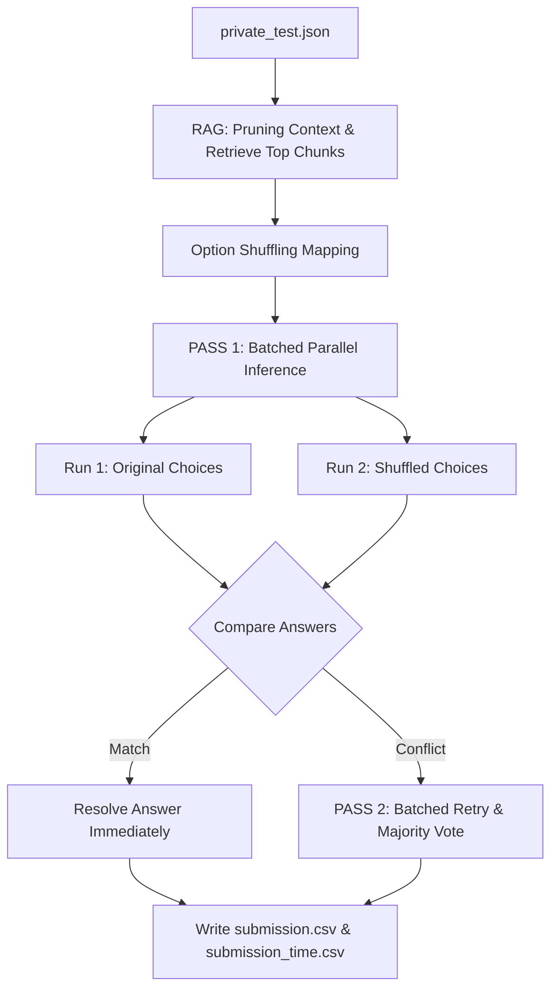

# Vietnamese Student HackAIthon 2026 - Bảng C Innovator Solution

Giải pháp Agent AI tiên tiến sử dụng kỹ thuật RAG tối ưu, Đối chiếu hai lượt (Double-Run), Tráo đổi lựa chọn (Option Shuffling) và Bầu chọn đồng thuận (Voting Consensus).

---

## 1. Pipeline Flow (Luồng xử lý của hệ thống)

Hệ thống được thiết kế theo cơ chế End-to-End từ khâu đọc câu hỏi, truy xuất tri thức bổ trợ (RAG), sinh câu trả lời song song và tự động sửa sai thông qua đối chiếu đáp án.



### Các bước xử lý chi tiết:
1. **Pre-retrieval Context Pruning & RAG**: Đọc và bóc tách các đoạn thông tin dạng ngữ cảnh từ đề bài. Sử dụng model embedding **BGE-M3** để trích xuất `top_k` ngữ cảnh có độ tương đồng cosine cao nhất với câu hỏi nhằm tối ưu token và tránh làm loãng ngữ cảnh.
2. **Option Shuffling**: Để triệt tiêu hoàn toàn thiên kiến vị trí (Position Bias) của LLM (thường có xu hướng chọn đáp án A hoặc B), hệ thống tiến hành tráo đổi ngẫu nhiên có kiểm soát vị trí của các lựa chọn trắc nghiệm.
3. **Pass 1 Batched Parallel Inference**: Gom nhóm các câu hỏi thành các prompt (4 câu/prompt) và đẩy song song vào GPU thông qua Hugging Face Pipeline Batching.
   - **Lượt 1**: Gửi đề bài gốc.
   - **Lượt 2**: Gửi đề bài đã tráo đáp án.
4. **Voting Consensus**: Đối chiếu kết quả Lượt 1 và Lượt 2 (đã ánh xạ ngược về chữ cái gốc).
   - Nếu đáp án trùng khớp $\rightarrow$ Ghi nhận kết quả ngay lập tức.
   - Nếu có mâu thuẫn $\rightarrow$ Đưa câu hỏi vào **Pass 2**.
5. **Pass 2 Retry & Resolution**: Chạy lại các câu hỏi bị mâu thuẫn thông qua cả 2 lượt trên GPU. Tiến hành bầu chọn đa số (Majority Voting) trong 4 đáp án thu được qua 2 pass `[ans1_p1, ans2_p1, ans1_p2, ans2_p2]` kết hợp cơ chế phân xử hòa phiếu (tie-breaking) để đưa ra câu trả lời thông minh nhất.
6. **Inference Time Logging**: Đo chính xác thời gian truy xuất (embedding) của từng câu, cộng với thời gian sinh từ của GPU chia đều cho số câu trong batch để ghi nhận thông tin thời gian chạy thực tế vào `submission_time.csv`.

---

## 2. Hướng dẫn chạy chương trình

### Yêu cầu hệ thống:
- Hệ điều hành hỗ trợ Docker và NVIDIA Container Toolkit (nếu sử dụng GPU).
- Python 3.8+ (nếu chạy local).

### Chạy trực tiếp bằng Python (Local):
1. Cài đặt các thư viện cần thiết:
   ```bash
   pip install -r requirements.txt
   ```
2. Chạy thử nghiệm ở chế độ **Mock** (không cần tải model nặng hay sử dụng GPU):
   ```bash
   python predict.py --mock --input_path public-test_1780368312.json --limit 10
   ```
3. Chạy thực tế bằng GPU (Tự động tải model Qwen và BGE-M3):
   ```bash
   python predict.py --input_path /path/to/private_test.json --model_id Qwen/Qwen2.5-7B-Instruct
   ```

---

## 3. Cấu hình Môi trường Docker

### Build Image:
```bash
docker build -t team_submission .
```

### Chạy Container (Máy chấm của BTC):
Hệ thống sẽ chạy file bash entrypoint `inference.sh`, tự động kích hoạt `predict.py` để đọc dữ liệu từ file `/code/private_test.json` được mount vào và xuất kết quả ra `/code/submission.csv` và `/code/submission_time.csv`.

```bash
docker run --gpus all -v /path/to/data:/code team_submission
```

---

## 4. Các tính năng tối ưu đặc biệt

- **GPU VRAM-Based Auto-Tuning**: Tự động phát hiện dung lượng VRAM của GPU máy chấm để điều chỉnh kích thước batch (từ 4 đến 32) nhằm khai thác tối đa sức mạnh phần cứng mà không lo bị tràn bộ nhớ (OOM).
- **Dynamic Model Path Resolution**: Tự động quét thư mục `/models/` để tìm và nạp phiên bản model Qwen thông minh nhất hiện có trên server BTC, giúp tránh lỗi không tìm thấy đường dẫn thư mục model.
- **Offline Packaging**: Model embedding `bge-m3` được tải trước và lưu trực tiếp trong Docker image lúc build, đảm bảo chạy offline 100% không cần kết nối mạng.
